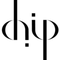
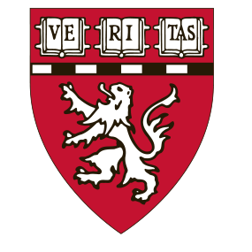

---
---

# Translating genetic data into disease biology and patient care

The Strober lab (PI: Ben) is a computational group focused on developing statistical and machine learning tools applied to human genetic and genomic data with the goals of elucidating disease biology and advancing genomically-informed precision medicine. We are particularly interested in modeling the regulatory cascade from DNA through molecular phenotypes, such as transcript and protein levels, to  diseases and traits, in order to illuminate mechanisms that drive disease. We also aim to integrate multimodal omics with the rich clinical data to refine diagnoses and guide precision-medicine interventions.

Our lab is part of the [Computational Health Informatics Program](https://www.chip.org/) at Boston Children's Hospital, a teaching affiliate of Harvard Medical School.

  
  
  



## Highlights



Check out recent publications from the lab.









Lorem ipsum dolor sit amet, consectetur adipiscing elit, sed do eiusmod tempor incididunt ut labore et dolore magna aliqua.









We are actively hiring to build our team! We welcome scientists at all levels and all backgrounds.






